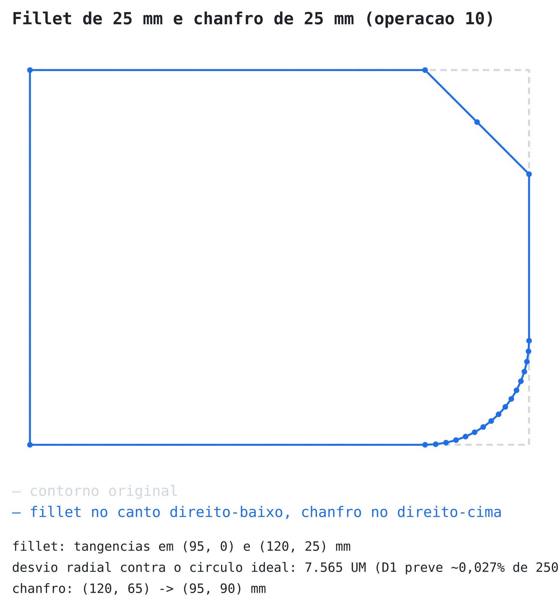
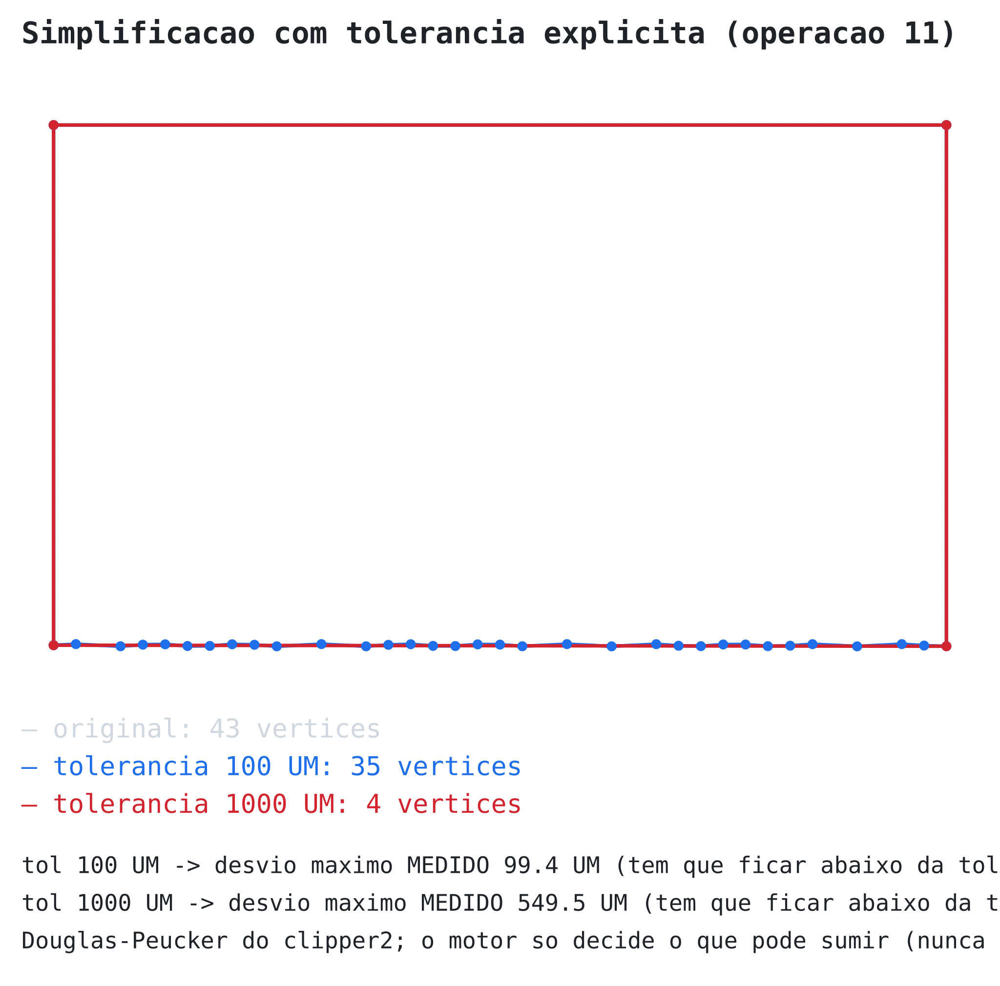
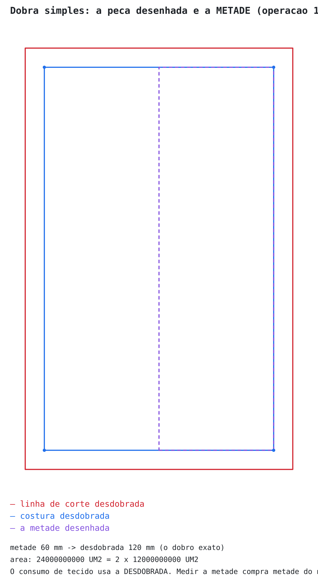
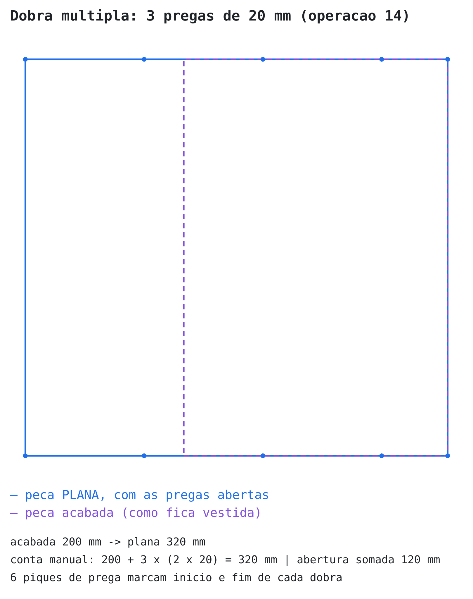
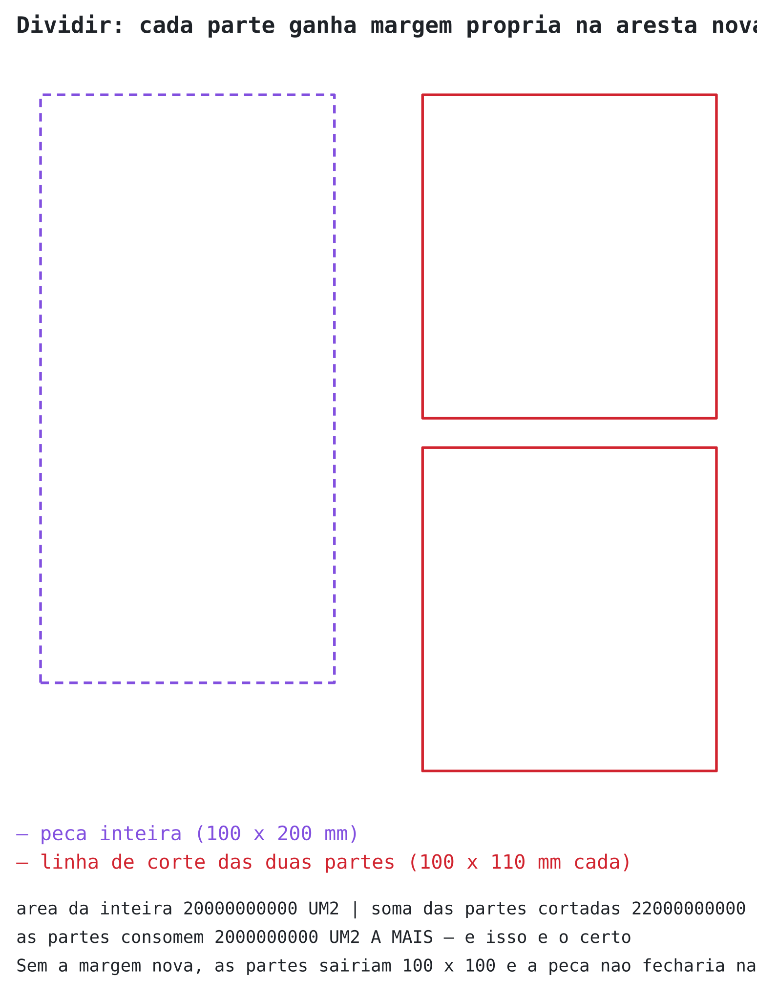
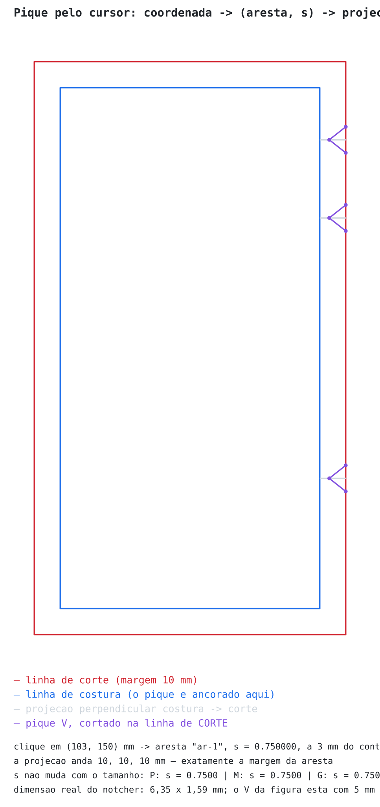

# FASE 1 · PARTE 6 — Estado do motor, orçamento de tolerância e decisões tomadas em código

> Parte **descritiva**, não normativa: registra o que já existe, medido, e as decisões que
> precisaram ser tomadas ao implementar. As Partes 0–5 continuam sendo a especificação.
> Atualizada ao fim da **Fase 1**: blocos 1 a 10, as operações 1 a 15 das Partes 2 e 3, e a
> persistência (Parte 8).

## Estado por bloco

| Bloco | O quê | Status | Onde |
|---|---|---|---|
| 1 | Tipos, constantes, vocabulário | **feito** | `src/tipos.ts`, `src/unidades.ts`, `src/erros.ts` |
| 2 | Ponto/Segmento/Aresta/Peça + fold puro | **feito** | `src/eventos/*`, `src/geometria/anel.ts`, `src/geometria/winding.ts` |
| 3 | Tesselar e medir | **feito** | `src/geometria/bezier.ts`, `tesselar.ts`, `aresta.ts`, `medir.ts` |
| 4 | Offset de margem | **feito**, margem por aresta inclusive (D6) | `src/offset.ts` |
| 5 | Graduação | **feito** (D7, D8, D8b) | `src/graduacao.ts` |
| 6 | Casamento e comparar perímetros | **feito** | `src/conferencia.ts` |
| 7 | Modificar ponto — discreto e proporcional | **feito** | `src/edicao.ts`, `src/geometria/deslocar.ts` |
| — | Operações 10 a 13: fillet/chanfro, simplificar, converter reta↔curva, inserir/excluir ponto | **feito** | `src/edicao.ts`, `src/geometria/bezier.ts` |
| — | Operação 5: espelhar / rotacionar / transladar | **feito** | `src/transformar.ts` |
| 8 | Dobra simples e dobra múltipla (pregas) | **feito** | `src/dobra.ts`, `src/pregas.ts` |
| 9 | Dividir peça | **feito** | `src/dividir.ts` |
| 10 | Validar inconsistências | **feito** | `src/validar.ts` |
| — | Projeção do pique costura → corte | **feito** (era a lacuna aberta da Parte 1) | `src/pique.ts` |
| — | Log de eventos + snapshot, Neon e SQLite | **feito** (Parte 8) | `packages/persistencia` |
| — | Backend Fastify | **feito** (Parte 8) | `packages/api` |

Testes: **180 passando** — 152 no motor, 18 na persistência e 10 na API. Da Parte 5 estão cobertos os **18 testes de exemplo** (o 14 pela metade — o lado da graduação;
a metade de edição da curva sai de graça do teste 17), mais entrada degenerada, os casos reais da
Parte 7 e oito propriedades — cinco delas em `fast-check`, com 150 a 300 casos aleatórios cada.

## D5 (nova) — A tesselação é do motor; o `verb` é oráculo, não fornecedor

A inegociável 3 manda tirar curva de biblioteca testada (`verb-nurbs`). Ao verificar antes de
usar, o amostrador adaptativo do verb foi **reprovado para este uso**, por dois motivos medidos:

1. **Não é determinístico.** `verb.eval.Tess.rationalCurveAdaptiveSampleRange` sonda a planeza
   num ponto sorteado — `var t = 0.5 + 0.2 * Math.random()` (`verb.es.js:7362`).
   Medido: **184 de 200** curvas Bézier aleatórias devolveram poligonais diferentes entre três
   chamadas com a mesma entrada e a mesma tolerância. Como a poligonal **nunca é persistida**
   (Parte 2, op. 2), o perímetro da mesma peça mudaria a cada leitura, e o teste de integridade
   da Parte 4 falharia por construção.
2. **A tolerância dele não é distância.** `verb.core.Trig.threePointsAreFlat` compara
   `|(P2-P1) × (P3-P1)|² < tol` (`verb.es.js:3763`) — unidade de **área ao quadrado**. Passar
   `TOLERANCIA_TESSELACAO_UM = 100` ali não significa "0,1 mm de desvio".

**O que se faz no lugar:** subdivisão de Casteljau no ponto exato `t = 0,5` até a **cota superior
provada** do desvio da corda cair abaixo da tolerância. Escrevendo o erro na base de Bernstein,
`|e(t)| ≤ (3/4)·max(|P1−L1|, |P2−L2|)` com `L1 = P0 + (P3−P0)/3` e `L2 = P0 + 2(P3−P0)/3`. É cota,
não estimativa. Conferida em 120 Béziers aleatórias: pior razão `desvio_real / cota = 0,93` (≤ 1).

**O que ficou do verb:** avaliação (`rationalCurvePoint`), comprimento de arco
(`rationalCurveArcLength`, Gauss-Legendre) e `rationalCurveClosestParam` — medidos como
determinísticos (200 curvas × 3 chamadas, 0 instáveis). Eles são usados **nos testes**, como
oráculo independente do que o motor produz. Por isso `verb-nurbs` passou para `devDependencies`:
o entry-point padrão do pacote toca `window` e **quebra no Node**; só o build ES roda headless.

## Orçamento de tolerância (a tabela que a Parte 1 pedia)

| Operação | Desvio máximo aceito | Medido | Justificativa |
|---|---|---|---|
| Tesselação de curva (geometria, offset, render) | `TOLERANCIA_TESSELACAO_UM` = **100 UM** (0,1 mm) | quarto de círculo R=10 mm: **51,1 UM** com 9 pontos | Constante da Parte 1. Metade da tolerância, na prática, porque a cota de subdivisão é conservadora |
| Arredondamento do vértice tesselado para inteiro | 0,5 UM por vértice | — | Inegociável 1 (núcleo em micrômetro inteiro). Três ordens de grandeza abaixo da tesselação |
| Medição de comprimento e ancoragem de pique por `s` | `TOLERANCIA_MEDICAO_UM` = **10 UM** (0,01 mm) | arco R=10 mm: **−2,2 UM** (−0,014%); R=100 mm: **−3,5 UM** (−0,0022%), contra o verb | Corda subestima arco, e o erro relativo cresce quando o raio cai. Medir na tolerância de tesselação gastaria 0,16% do comprimento em curva apertada — 1,6 mm por metro de costura, 8× o desvio de casamento aceito na prática |
| Casamento de costura | `TOLERANCIA_CASAMENTO_UM` = **200 UM** (0,02 cm) | par de cavas congruentes: **0 UM** de diferença em P, M e G | Dois tetos se encontrando: a referência real observada na confecção (0,00–0,02 cm) e o erro de medição do motor (0,015% ≈ 75 UM numa cava de 500 mm). Limite mais apertado acusaria ruído de medição como defeito, e o modelista aprenderia a ignorar o alerta |
| Bézier cúbica aproximando arco de círculo (D1) | ~0,027% do raio | R=100 mm: **18,4 UM** (0,0117%) contra o círculo exato | Já aceito na D1. Note que **não é erro de implementação**: é a curva escolhida. Some-se ao erro de medição, não se confunda com ele |
| Fillet por `κ = 4/3·tan(θ/4)` (D1) | ~2,7 µm em raio de 10 mm | — | Operação 10, ainda não implementada |
| Round-trip de DXF | **a definir** | — | Fase 3 |
| Simplificação (Douglas-Peucker) | tolerância explícita do chamador | — | Operação 11, ainda não implementada |
| Digitalização por foto | **a definir** | — | Fase futura |

**Consequência assumida:** o pique ancorado por `s` sai da tabela **fina** (10 UM) e cai sobre a
curva de verdade; a poligonal **grossa** (100 UM) usada no offset pode se afastar dele em até
100 UM. A curva é a fonte de verdade, não a poligonal grossa.

## D6 (nova) — Offset por aresta: deslocamento paralelo aqui, união no clipper

`ClipperOffset.executeWithCallback` **não resolve margem por aresta**. Lendo a implementação
(`clipper2-ts/dist/Offset.js:430`), o callback devolve **um delta por VÉRTICE**, e `offsetPoint`
usa esse mesmo delta nos dois lados da junção: chama `doMiter` com `normals[k]` (aresta que chega)
e `normals[j]` (aresta que sai) e um `groupDelta` só. No retângulo com bainha de 40 mm e lateral
de 10 mm, o canto verdadeiro é o cruzamento de `y = −40` com `x = L+10`, ou seja `(L+10, −40)`;
com um delta só sai `(L+d, −d)` — nem 10 nem 40 resolve.

**O que se faz:** transladar cada corda pela margem da **sua** aresta ao longo da normal externa e
fechar o canto no ponto de **Miter** — o único ponto que fica à margem certa das duas retas ao
mesmo tempo:

```
u = a·n_chega + b·n_sai,   a = (m_chega − c·m_sai)/(1 − c²),   b = (m_sai − c·m_chega)/(1 − c²)
```

Com `m_chega = m_sai = m` isso colapsa em `u = (n_chega + n_sai)·m/(1+c)`, que é literalmente a
fórmula do `doMiter` do clipper — e é assim que está escrito no código, para o resultado sair
idêntico ao da biblioteca em vez de só parecido. O critério do limite de miter também é o do
clipper (`cos > 2/LIMITE_MITER² − 1`), e o corte de canto agudo é o **square** dele, não um bevel
simples: bevel passaria a só `m·cos(φ/2)` do vértice e comeria margem bem na ponta.

**Canto côncavo não leva miter** — e essa foi a correção mais cara desta parte, descoberta pela
propriedade de fast-check depois de tudo já estar "passando". O ponto de miter de um canto reflexo
é um offset legítimo das duas arestas **vizinhas**, mas num entalhe fundo ele pode cair **dentro da
faixa de uma aresta distante**: fica a menos de uma margem de outro lado da peça. Como o anel
resultante não se auto-intersecta, a união não tem o que limpar, e sobra uma **agulha** — medida:
1980 UM (≈ 2 mm) de comprimento por ~14 UM de largura, que o plotter desenharia como um espinho no
molde. A saída é a mesma do clipper (`offsetPoint`, `Offset.js:441`): inserir os dois pés de
perpendicular com o **vértice no meio**, criando de propósito uma região de orientação negativa que
a união com `FillRule.Positive` remove — junto com tudo que ficou coberto por outra aresta.

**A parte perigosa continua sendo do clipper:** auto-interseção, laços negativos em concavidade e
reversão de contorno são resolvidos por `union(..., FillRule.Positive)`.

**Como isso é verificado** (é o que sustenta o desvio):

| Verificação | Resultado |
|---|---|
| Teste 1 — margem uniforme 10 mm em 100×200 | corte **120×220 mm exatos**, 4 vértices, produtos escalares nos cantos todos 0 |
| Teste 2 — bainha 40 mm + laterais 10 mm | corte **120×250 mm exatos**, cantos em `(110, −40)` e `(−10, −40)`, área 30.000.000.000 UM² |
| Margem 0 numa aresta (dobra do tecido) | aquele trecho fica **sobre** a linha de costura; os outros crescem 10 mm |
| Consistência com `inflatePaths`, formas fixas (retângulo, triângulo agudo, L côncavo × 3 margens) | anéis **idênticos**, coordenada por coordenada |
| Propriedade fast-check, 300 polígonos × 8 execuções | anéis **idênticos coordenada por coordenada** ao `inflatePaths`: Hausdorff **0,000 UM** |
| Propriedade fast-check, 300 polígonos aleatórios | `área(corte) > área(costura)` sempre; menor razão observada 1,0001 |

**Não há diferença residual.** Antes da correção de canto côncavo havia um afastamento de ~2 UM
que eu vinha explicando como "estilo de arredondamento" — e essa explicação estava errada: era o
mesmo defeito da agulha, em escala pequena. Depois da correção, os dois anéis saem **iguais
coordenada por coordenada** em milhares de polígonos aleatórios.

Vale registrar como o defeito escapou: os testes de forma fixa (retângulo, triângulo agudo, L
côncavo) já batiam exatamente, e o L côncavo tem um reflexo **raso**, que não chega a ser engolido
por aresta distante. Só o gerador aleatório produziu o entalhe fundo. Foi a propriedade que achou —
e por duas vezes eu quase a silenciei afrouxando o limite dela, o que teria escondido o defeito.

**Entrada degenerada é assertada, não pulada.** Quando o polígono é uma lasca fina demais para a
margem (vértice em reversão de 180°), o clipper parte o offset em mais de um anel e o motor
**recusa** com `OFFSET_MULTIPLOS_ANEIS` — a mesma resposta dita de outro jeito, e a propriedade
verifica isso em vez de descartar a amostra.

## D7 / D8 / D8b (novas) — Graduação

A Parte 2 deixava duas coisas em aberto ("ambíguo hoje; muda o resultado"). Ficaram assim:

**D7 — não há âncora global.** Cada grade point tem a sua regra; grade point **sem** regra (ou com
regra 0,0) não se move. A âncora é *emergente*: são os pontos que ficaram parados. É como o
AAMA/ASTM grada, e por isso a importação da Fase 3 mapeia 1:1 — não existe no DXF nenhuma "origem
da graduação" que a leitura teria que inventar.
Consequência: `MarcarGradePoint` sem `DefinirRegraGraduacao` **não é dado faltando**, é a
declaração da âncora. Grade point marcado e esquecido por engano é caso do validador (operação 8,
Bloco 10), que **relata**; graduar não pode estourar por isso.

**D8 — o incremento é entre tamanhos consecutivos; o acumulado é do motor.** A `RegraGraduacao`
guarda `(deTamanho, paraTamanho, dx, dy)` com os dois tamanhos **vizinhos** na grade — o fold
recusa regra que pule tamanho. Para um tamanho distante o motor soma os passos; para um menor,
subtrai os do caminho de volta. O modelista escreve a tabela como ela é escrita na prática; o
acumulado nunca é digitado a mão.

**D8b — quem não é grade point acompanha proporcionalmente.** Entre dois grade points vizinhos no
contorno, o ponto intermediário recebe a interpolação dos dois deslocamentos, pesada pela posição
dele em **comprimento de arco** (a mesma régua do `s` do pique). Dentro de um segmento o campo de
deslocamento é linear em `t`, e somar um campo linear a uma Bézier cúbica dá **exatamente** outra
Bézier cúbica: por isso os dois pontos de controle andam `1/3` e `2/3` do caminho entre os
deslocamentos dos extremos. A curva não é reamostrada nem aproximada.
Se os pontos livres ficassem parados, a cava entre um grade point que andou 6 mm e um vizinho
parado mudaria de formato a cada tamanho.

**Números conferidos:**

| Verificação | Resultado |
|---|---|
| Teste 4 — retângulo 100×200, base M, regras +6 mm x (pt-1), +6/+4 (pt-2), 0/+4 (pt-3) | P `(0,0) (94,0) (94,196) (0,196)` · M `(0,0) (100,0) (100,200) (0,200)` · G `(0,0) (106,0) (106,204) (0,204)` |
| D7 — pt-0 é grade point **sem** regra | fica em `(0,0)` em P, M e G |
| Medida acompanha | `ar-baixo` = **94, 100 e 106 mm** em P, M, G |
| Graduar para o tamanho base | peça **idêntica** à original |
| D8b — vértice livre | grade points só em pt-0 (parado) e pt-2 (+30 mm x); perímetro 600 mm → pt-1 a 1/3 do trecho anda **+10 mm**, pt-3 a 1/3 do trecho de volta anda **+20 mm** |
| D8b — controles da Bézier | extremos andam +30 mm e 0 → controle[0] anda **+20 mm**, controle[1] **+10 mm** |
| Pique por `s` sob graduação (metade do teste 14) | `s = 0,5` continua partindo o arco ao meio: M **78550,7 / 78550,7 UM**, G **88778,1 / 88777,4 UM** (medido pelo verb na Bézier já graduada) |
| Propriedade fast-check, 200 casos / 1100 pontos | nenhum ponto anda mais que o grade point que mais andou; pior razão **1,0000** |

**Recusas** (erro explícito, nunca graduação silenciosamente errada): `TAMANHO_DESCONHECIDO`,
`REGRA_GRADUACAO_NAO_CONSECUTIVA`, `REGRA_GRADUACAO_DUPLICADA`, `GRADE_POINT_DUPLICADO`,
`GRADE_POINT_INEXISTENTE`, `GRADUACAO_DE_INTERNOS_NAO_DECIDIDA`.

**Desvio de assinatura:** a Parte 1 esboçava `aplicarGraduacao(peca, tamanho)`, mas a grade de
tamanhos e as `RegraGraduacao` vivem no **Modelo** (e o mesmo modelo grada várias peças). Ficou
`aplicarGraduacao(modelo, pecaId, tamanho)`. A alternativa seria duplicar a grade dentro de cada
peça — dado repetido que sai de sincronia.

## Bloco 6 — conferência (operações 6 e 7)

`validarCasamento(modelo)` e `compararPerimetros(modelo, mais, menos)` em
`src/conferencia.ts`. As duas **relatam**; nenhuma conserta nada.

**Duas escolhas que valem registrar:**

- **O par de costura é dado declarado, nunca inferido.** Duas arestas com o mesmo comprimento não
  formam um par — par é o que o modelista declarou com `DefinirParCostura`. Inferir pela geometria
  acertaria por acaso no molde simples e erraria feio no molde real, onde várias arestas medem
  parecido. Há teste para isso: o mesmo modelo, com `paresCostura` vazio, não reporta nada.
- **A validação percorre a grade inteira, não só o base.** Casamento no tamanho base não prova
  nada: o erro clássico é a regra abrir a cava da frente e não a da manga, e a peça só não fechar
  no GG.

**Números conferidos:**

| Verificação | Resultado |
|---|---|
| Teste 5 — cava da frente × cava da manga, mesmos saltos | P **148866 / 148866** · M **157098 / 157098** · G **165447 / 165447** UM → diferença **0** nos três; `validarCasamento` devolve lista vazia |
| A cava realmente cresce (senão o teste acima passaria à toa) | 148866 → 157098 → 165447 UM |
| Regra que abre só a frente | acusa **2 erros** (P: −8232 UM · G: +8349 UM) e **não** acusa no base M, onde ainda casa |
| Diferença abaixo da tolerância (manga 0,1 mm mais aberta por tamanho) | **63 UM** em G → **0 problemas**. Deslocar um extremo em 0,1 mm move o arco bem menos que 0,1 mm |
| Sem `ParCostura` declarado, cavas idênticas | **0 problemas** — o motor não infere par |
| Conferência `(ar-baixo + ar-cima) − ar-direita` no retângulo graduado | P **188 − 196 = −8 mm** · M **200 − 200 = 0** · G **212 − 204 = +8 mm** |
| Conferência atravessando peças (cava frente − cava manga) | **0 UM** em P, M e G |
| Perímetro da FRENTE (lado `menos` vazio) | **33,587 / 35,710 / 37,845 cm** |
| Propriedade fast-check, 150 casos / 450 medições | arestas pareadas com os mesmos saltos: maior diferença **0 UM** |

**Recusas:** `ARESTA_INEXISTENTE` (aresta que não existe em nenhuma peça — não soma zero em
silêncio) e `CONFERENCIA_SEM_ARESTAS`.

**Sobre a propriedade "casamento preservado" da Parte 5.** Escrita como está lá — *"para qualquer
regra de graduação, arestas pareadas continuam com o mesmo comprimento"* — a afirmação é **falsa**,
e de propósito: uma regra que abre a frente e não a manga quebra o casamento, e é exatamente o
defeito que `validarCasamento` existe para pegar. A invariante que o motor garante, e que está
testada com `fast-check`, é a outra metade: **quando os dois extremos das duas arestas pareadas
recebem o mesmo salto, as curvas graduadas são congruentes e os comprimentos continuam iguais** —
em qualquer raio e qualquer salto. Se a propagação da D8b não fosse afim, isso quebraria.

**Limitação herdada:** `validarCasamento` e `compararPerimetros` graduam para medir, então herdam a
recusa de graduar peça com linha interna (logo abaixo). Não é uma segunda pendência, é a mesma.

## Bloco 7 — modificar ponto (operação 9)

`modificarPonto(peca, pontoId, dx, dy, modo, nVizinhos)` em `src/edicao.ts`, com o evento
`ModificarPonto` (o `MoverPonto` que já existia é coordenada **absoluta**; este é o delta que o
modelista arrasta). A função de decaimento é a da Parte 3, literal:

```
f(i) = (1 + cos(π·i/(N+1))) / 2,   i = 1..N
```

O índice `i` é **posição no contorno** (topologia), não distância: o vizinho imediato é `i = 1`
mesmo que esteja a 2 mm ou a 20 cm. É o que a Parte 3 manda e o que o modelista espera de "N
pontos de influência".

**Refatoração:** o campo de deslocamento saiu da graduação para `src/geometria/deslocar.ts`, usado
agora pelos Blocos 5 e 7. É lá que está a prova de por que os controles da Bézier andam `1/3` e
`2/3` — o mesmo campo linear, aplicado uma vez só.

**Números conferidos:**

| Verificação | Resultado |
|---|---|
| Teste 6 — discreto, `dx = 10 mm` em pt-0 de um 9-gono | só pt-0 anda `(10000, 0)`; os outros 8 ficam com a **coordenada idêntica**, não só delta zero |
| Curva sob edição discreta | os controles do segmento acompanham (`6667` e `3333` UM = 2/3 e 1/3 de 10 mm) — se ficassem parados a tangente giraria sozinha. Controle não é ponto de contorno; o teste 6 continua valendo |
| Teste 7 — proporcional, `N = 3` | `f(1) = 0,8535533905932737` · `f(2) = 0,5` · `f(3) = 0,1464466094067263` → **8536 / 5000 / 1464 UM**, iguais dos dois lados; pt-4 e pt-5 **não se movem** |
| `N = 1` | vizinho anda exatamente **5000 UM**, metade do alvo |
| `N = 0` proporcional | idêntico ao discreto |
| Simetria `f(i) + f(N+1-i) = 1`, N = 1..40 | pior desvio **4,44e-16**; `f(0) = 1` e `f(N+1) = 0` |
| Evento × chamada direta | `fold(ModificarPonto)` produz estado **idêntico** a `modificarPonto()`, e o replay continua determinístico |

**Recusas:** `N_VIZINHOS_EXCEDE_CONTORNO` (num contorno de 9 vértices, `N = 4` cabe e `N = 5` não),
`N_VIZINHOS_INVALIDO` (negativo, fracionário, NaN), `UM_NAO_INTEIRO` (float de mm vazando no
delta), `PONTO_INEXISTENTE`, `PONTO_FORA_DO_CONTORNO` (só no proporcional — no discreto um ponto de
construção solto pode andar, já que não há vizinhança a propagar).

**Sobre a sobreposição:** se `2N + 1` passa da quantidade de vértices, um mesmo ponto seria vizinho
`i` pela esquerda e `j` pela direita, e não existe resposta certa para quanto ele anda. O motor
recusa, em vez de somar os dois fatores e devolver um ponto deslocado **mais que o próprio alvo**.

## D9 (nova) — Embebido: costuras que casam NÃO têm o mesmo comprimento

Achado da pesquisa da Parte 7, e o mais grave até agora. Em tecido plano a copa da manga é **de
propósito** mais comprida que a cava — é o embebido, e é ele que dá volume ao ombro. Valores
praticados: camisa de ombro caído até 25 mm (às vezes zero), blusa de manga montada 25 mm,
alfaiataria 20–50 mm, malha zero.

`validarCasamento` exigia comprimentos **iguais** com tolerância de 200 UM. Um embebido de 25 mm
são **25 000 UM — 125× a tolerância**. O motor reprovaria toda peça de tecido plano. Os 92 testes
anteriores passavam porque os fixtures foram construídos com as duas cavas congruentes: provavam
coerência interna, não compatibilidade com o ofício.

**A correção:** `ParCostura` ganha `embebidoUM` — quanto `arestaB` deve ser **maior** que `arestaA`.
`validarCasamento` compara a *sobra* contra o embebido declarado, não contra zero.

- **Obrigatório no payload do evento, sem default.** "Esta costura fecha exata" e "esta copa embebe
  25 mm" são decisões de modelagem diferentes; assumir zero por omissão esconderia a manga que
  ficou sem embebido.
- **Aceita negativo.** O sinal só diz qual das duas é a maior, então quem emite não precisa
  reordenar o par.

| Verificação | Resultado |
|---|---|
| Blusa: cava R=150 mm, copa com raio `R + 25/(π/2)` | cava **235651 UM**, copa **260653 UM**, sobra **25002 UM** (25,002 mm); embebido declarado 25000 → desvio **2 UM** → **0 problemas** |
| A mesma geometria com `embebidoUM = 0` | **3 erros** (um por tamanho), acusando `+25002 UM fora` — prova que o campo é lido, e não que o teste acima passou por acidente |
| Malha: copa igual à cava, embebido 0 | sobra **0 UM** → **0 problemas** (o caso antigo não quebrou) |
| Embebido 25 mm declarado, geometria sem sobra | erro com os três números: `sobra de 0 UM` · `25000 UM maior (embebido declarado)` · `-25000 UM fora` |
| Embebido **−25 mm** com a copa menor | sobra **−25004 UM** → **0 problemas** |
| `embebidoUM = 25,5` | `UM_NAO_INTEIRO` — a barreira de micrômetro inteiro também vale aqui |


## Conceitos do DXF ASTM que faltavam no modelo (Parte 7, caso 1)

A inegociável 5 manda o modelo carregar os conceitos do padrão **desde o dia zero**, para a
importação da Fase 3 mapear 1:1. A conferência camada a camada achou três buracos, todos fechados:

1. **`TipoPique` não cobria as camadas 82 e 83.** Acrescentados `CHECK` (82) e `U` (83); os oito
   nomes do cliente continuam intactos. Junto veio `CAMADA_ASTM_DO_PIQUE`, o mapeamento como
   **dado** e não como lore: `I` `V` `V1` `V2` → **4** · `T` → **80** · `MX` `M+` `MX2` → **81** ·
   `CHECK` → **82** · `U` → **83**.

   Teste conferido: todo tipo tem camada, e as cinco camadas da norma estão todas alcançadas.
   ⚠ `M+` e `MX2` estão em 81 por leitura do nome (variantes de *castle*) — **confirmar com o
   cliente** antes da Fase 3. Os outros oito vêm direto da norma.

2. **Recorte interno (camada 11) não existia.** Uma peça com vazado — casa de gola, furo de alça —
   não era representável, porque `Peca` só tinha o contorno externo. Agora `Peca.recortes` existe,
   e as duas operações que não sabem tratá-lo **recusam**: `offsetMargem` estoura
   `RECORTE_AINDA_NAO_SUPORTADO` (devolver só o anel externo mandaria para a mesa uma peça **sem o
   vazado**, e o defeito só apareceria no tecido cortado) e `aplicarGraduacao` estoura
   `GRADUACAO_DE_INTERNOS_NAO_DECIDIDA`.

3. **Linha de referência de graduação (camada 5) não tinha par.** `TipoLinhaInterna` ganhou
   `referenciaGraduacao`. O motor não gradua por ela (D7: a âncora é emergente), mas o conceito
   sobrevive ao round-trip em vez de virar linha genérica.

**Ainda abertas** da mesma conferência: camadas 9 e 10 (referência de listra e xadrez) — são de
encaixe e podem esperar a Fase 5.

## Operações 10 a 13 — edição de contorno

Todas em `src/edicao.ts`, cada uma com o seu evento. Duas regras atravessam as quatro:

- **O ID da aresta nunca muda (D3).** Inserir um ponto parte um segmento em dois e **os dois ficam
  na mesma aresta**. Arredondar um vértice troca dois segmentos por três e as arestas envolvidas
  mantêm o id. Se alguma renumerasse, margem por aresta e `ParCostura` passariam a apontar para o
  lugar errado em silêncio — a armadilha que a D3 existe para evitar.
- **Os IDs vêm de fora (D2).** Toda operação que cria entidade recebe um `prefixoId` e deriva os
  ids dele deterministicamente. Estas funções rodam **dentro do fold**, e entropia no fold quebra
  o replay.

### 13 — inserir / excluir ponto (teste 17)

`s` é posição por **comprimento de arco**, nunca o `t` cru. Em curva a divisão é por de Casteljau:
as duas metades **são** a curva de antes.

| Verificação | Resultado |
|---|---|
| Inserir em `s = 0,5` no lado (0,0)–(100,0) | ponto em **(50, 0) mm**; contorno 4 → 5 segmentos; as 4 arestas e as margens **intactas**; os dois pedaços em `ar-baixo` |
| A peça não muda de forma | medida da aresta **igual**, e a linha de corte sai **idêntica** |
| Inserir no meio de uma **curva** | arco medido **157098 → 157098 UM** (diferença 0); desvio de forma **0,930 UM**; os dois pedaços em `ar-arco` |
| Remover o ponto inserido | devolve `pontos`, `segmentos`, `arestas` e `contorno` **idênticos** ao original |

**Recusas:** `PONTO_NOTAVEL_NAO_REMOVIVEL` (extremo de aresta), `GRADE_POINT_NAO_REMOVIVEL`,
`MERGE_DE_CURVA_NAO_REPRESENTAVEL` — fundir duas Béziers cúbicas não dá, em geral, outra Bézier
cúbica, então a fusão mudaria o desenho. Quem reduz ponto de curva é a operação 11, que tem
tolerância explícita.

### 12 — converter reta ↔ curva

`reta → curva` põe os controles a 1/3 e 2/3 da própria reta: a Bézier resultante **é** a reta.
Converter, por si só, não muda medida nenhuma — o desenho só muda quando o modelista mexer nos
controles. É o que evita uma peça mudar de tamanho porque alguém trocou o tipo do segmento.
Conferido: medida do lado igual e linha de corte **idêntica**. `curva → reta` descarta os
controles e encurta (arco → corda), preservando os extremos.

### 10 — fillet e chanfro (teste 16)

Circunferência **inscrita** no ângulo: tangente aos dois lados, tangências a `raio / tan(φ/2)` do
vértice. Arco varrido `θ = π − φ`, e a Bézier usa `κ = 4/3·tan(θ/4)` (D1).

| Verificação | Resultado |
|---|---|
| Fillet R = 10 mm num canto de 90° do retângulo | tangências exatas em **(90, 0)** e **(100, 10)** mm |
| Desvio radial contra o círculo ideal, medido pelo **verb** em 2000 parâmetros | **2,6997 UM** — a D1 previa ~2,7 µm (0,027% de 10 mm) |
| Fillet R = 25 mm (figura 7) | desvio **7,565 UM** = 0,030% de 25 mm |
| Chanfro de 20 mm | **(80,0) → (90,10) → (100,20)** mm, exatos |

**O canto entre duas arestas.** `pt-1` é fim de `ar-baixo` e início de `ar-direita`; o fillet apaga
esse ponto. Em vez de recusar, o arco é **partido ao meio por comprimento de arco** e o ponto do
meio vira a nova fronteira: as duas arestas **mantêm o id**, `ar-baixo` termina em `fil-m` e
`ar-direita` começa nele, e as margens ficam intactas. É a única leitura simétrica, e sem ela a
operação seria inútil justamente no canto onde mais se usa fillet.

**Recusas:** `FILLET_NAO_CABE` (R = 200 mm num lado de 100 mm), `RAIO_INVALIDO`,
`FILLET_EM_CURVA_NAO_SUPORTADO` — achar a tangência sobre uma Bézier é outra operação, e
aproximar aqui seria errar em silêncio.



### 11 — simplificar contorno (teste 8)

O algoritmo é o `ramerDouglasPeucker` do **clipper2** (inegociável 3: não reimplementar
simplificação existindo biblioteca). O que é do motor é decidir **o que pode sumir**. Nunca somem:
pontos notáveis (extremos de aresta), grade points, e extremos de segmento em curva. Sobram as
corridas de retas consecutivas **dentro de uma mesma aresta** — que é onde a digitalização e a
importação deixam pontos demais.

| Tolerância | Vértices | Desvio máximo **medido** |
|---|---|---|
| 10 UM | 43 → 36 | **9,00 UM** |
| 50 UM | 43 → 8 | **49,09 UM** |
| 100 UM | 43 → 4 | **54,65 UM** |
| 1000 UM | 43 → 4 | **54,65 UM** |

"A peça simplificada nunca desvia da original além da tolerância" — conferido **medindo**, como a
Parte 3 manda, não confiando no algoritmo. O grade point marcado no meio do trecho ruidoso
sobrevive a uma tolerância de 1000 UM, e as arestas continuam todas com os mesmos ids.



### Efeito colateral achado: a linha de corte agora ignora ponto colinear

Inserir um ponto colinear no contorno fazia aparecer um vértice a mais na **linha de corte** — a
peça não mudava de forma, mas o resultado do `offsetMargem` passava a depender de quantos pontos o
modelista clicou, e não da forma da peça. `offsetMargem` passou a rodar o `trimCollinear` do
clipper2 no anel de saída. Vértice onde duas arestas de **margens diferentes** se encontram não é
colinear (há um degrau perpendicular), então esse sobrevive.

## D10 (nova) — Geometria interna é feita de `Ponto`, como o contorno

`LinhaInterna` e `Recorte` guardavam `Vetor2[]` cru. Por isso o fio, a pence e o furo **não podiam
ser grade point**: a graduação não tinha onde pegar. Guardando **id de `Ponto`**, a geometria
interna passa a graduar pela mesma regra do contorno (D7: ponto com regra anda, ponto sem regra é
âncora) — sem mecanismo novo.

Isso removeu a recusa `GRADUACAO_DE_INTERNOS_NAO_DECIDIDA`, que era a pendência mais antiga em
aberto. A ponta solta que a recusa protegia — fio esquecido parado numa peça que cresce — passou
para o **validador**, que a relata como aviso `PONTO_INTERNO_SEM_REGRA`. É a divisão certa: o motor
faz o que foi declarado; o validador aponta o que é suspeito.

| Verificação | Resultado |
|---|---|
| Fio com grade point na ponta de cima (+4 mm/tamanho) e âncora embaixo | em G: `fio-a` fica em **(50, 20)**, `fio-b` vai para **(50, 184)** mm |
| Furo sem grade point numa peça que gradua | fica em **(30, 30)** mm enquanto `pt-1` vai para **(106, 0)** — e o validador avisa |
| Recorte com grade point num vértice | `rc-0` **(42, 90)**, `rc-1` (sem regra) **(60, 90)** mm; o offset continua recusando o vazado |

## Operação 5 — espelhar, rotacionar, transladar

`src/transformar.ts`. Bézier é invariante afim, então os quatro pontos de controle são
transformados direto — nada a reamostrar. Espelhar inverte o winding, e a D4 exige CCW: por isso
`espelharPeca` renormaliza no fim, o que também reflete o `s` dos piques.

| Verificação | Resultado |
|---|---|
| **Teste 10** — espelhar num eixo a 30° pela origem | pior erro contra o cálculo analítico da reflexão: **0,467 UM** (só arredondamento) |
| Winding depois de espelhar | volta a **CCW**; área muda **0,00036%** (perturbação do arredondamento) |
| Transladar por inteiro | **exato**: `(100, 200) → (137, 188)` mm |
| Rotacionar 90° quatro vezes | desvio contra o original: **0 UM** |
| Propriedade, 200 casos / 800 pontos | espelhar 2× no mesmo eixo volta ao original; pior desvio **1,000 UM** (dois arredondamentos) |

## Bloco 8 — dobra

**Dobra simples** (`src/dobra.ts`): a peça desenhada é a **metade**; o desdobrado é geometria
**derivada**, como a linha de corte, e por isso as funções devolvem `Poligono` e não `Peca` —
devolver uma `Peca` desdobrada obrigaria a inventar arestas e margens para o lado espelhado, e a
próxima edição teria duas verdades sobre a mesma peça.

| Verificação | Resultado |
|---|---|
| **Teste 9** — meia frente 60×200 com eixo na lateral | desdobrada **120 × 200 mm**, o dobro exato; área **exatamente 2×**; 4 vértices (sem vinco no meio) |
| Linha de corte desdobrada, margem 0 na dobra | **140 × 220 mm** — 60+10 de cada lado, e nada a mais na dobra |
| Eixo no meio da peça | `EIXO_DOBRA_ATRAVESSA_A_PECA` — espelhar assim poria o reflexo em cima da própria peça e o consumo sairia menor que o real |

**Dobra múltipla / pregas** (`src/pregas.ts`): uma prega de profundidade `D` consome `2D` de largura
plana — a conta do ofício, e vale igual para prega macho e sanfona (a direção muda como a prega
assenta, não quanto tecido leva). Os cruzamentos com o eixo viram vértices (operação 13) e tudo do
lado de lá é transladado — o "slash and spread" da modelagem, sem aproximação.

| Verificação | Resultado |
|---|---|
| **Teste 11** — 3 pregas de 20 mm numa saia de 200 mm | conta manual `200 + 3×(2×20) = 320`; motor: **200 → 320 mm** |
| Piques de prega | **6** (início e fim de cada uma das 3), nas arestas de cima e de baixo |
| Sob graduação (P/M/G) | acabada 170/200/230 mm → plana 290/320/350 mm; a abertura é **sempre 120 mm**, porque é a profundidade declarada |





## Bloco 9 — dividir peça

`src/dividir.ts`. Os cruzamentos do eixo com o contorno são **inseridos** (operação 13, já testada)
antes de partir. Isso dá duas coisas de graça: a curva cortada é dividida por de Casteljau sem
virar poligonal, e cada pedaço continua sabendo de que aresta veio — então a margem de cada aresta
herdada segue junto, **com o mesmo `arestaId`** (D3).

| Verificação | Resultado |
|---|---|
| **Teste 12** — 100×200 cortado ao meio, margem nova 10 mm | costura de cada metade **100 × 100 mm**; linha de corte **100 × 110 mm** (não 100×100) |
| Consumo | inteira 20.000.000.000 UM² → partes somam **22.000.000.000 UM²**; a mais: **exatamente 2×(100×10) mm²** |
| Piques de casamento | um em cada parte, `s = 0,5` na aresta nova — é por eles que se costura de volta |
| Arestas | parte 1 fica com `ar-cima`, parte 2 com `ar-baixo`, as duas com pedaços das laterais; **ids preservados** |
| Nome derivado | `RETANGULO_1` e `RETANGULO_2`; encaixe e tenant herdados |
| Fio atravessando o corte | **recortado no eixo**: cada parte fica com um ponto novo em `y = 100` mm, e o fio sobrevive nas duas |
| Sob graduação | peça 160/200/240 mm → cortada na metade relativa dá **80+80, 100+100, 120+120 mm** |



## Bloco 10 — validar inconsistências

`src/validar.ts`. O validador **relata**; nunca conserta. Gravidade `erro` para o que impede o
corte, `aviso` para o que é suspeito mas pode ser intencional.

**Sobre o `catch`:** a Parte 0 proíbe `catch` *silencioso*. Aqui há um, e não é silencioso: as
operações de geometria estouram no primeiro defeito, e um validador que parasse no primeiro seria
inútil — o modelista quer a lista inteira. O `catch` converte o `ErroMotor` em `Problema`
**preservando código e mensagem**, e só para `ErroMotor`: qualquer outra exceção sobe.

| Defeito | O que sai |
|---|---|
| Peça completa e correta | **0 problemas** |
| Sem fio | `aviso FIO_AUSENTE` (peça pequena de aviamento às vezes é cortada sem fio) |
| Margem ausente e margem negativa | 2 × `erro` |
| Gravata-borboleta assimétrica | `erro CONTORNO_AUTO_INTERSECTADO` — shoelace 4.000.000.000 UM² × união 4.333.320.000 UM² em 2 regiões |
| Pique órfão e pique com `s = 1,4` | `PIQUE_ORFAO` e `PIQUE_FORA_DA_ARESTA` |
| Grade point sem regra; ponto interno parado | 3 × `aviso` (D7 + D10) |
| Contorno aberto | vira `Problema`, **não estoura** |
| `validarModelo` num modelo de 2 peças | junta as peças e o casamento: 7 problemas, dos quais 3 `CASAMENTO_DIVERGENTE` |

**Nota:** a auto-interseção é detectada comparando o shoelace com a união do próprio anel (feita
pelo clipper2). Numa gravata-borboleta **simétrica** os dois laços têm área igual, o shoelace dá
zero e o `AREA_ZERO` dispara antes — o teste usa uma assimétrica de propósito.

## Teste 13 — integridade do event sourcing

Log rico: 2 peças, curva, graduação, edição de ponto, inserção, conversão de segmento, fio, eixo de
dobra, translação e par de costura — **50 eventos**.

```
replay == snapshot JSONB:            true
round-trip JSON.parse/stringify:     true
fold incremental == reconstruir(log): true
ids derivados de prefixo estáveis:   f-0, f-1, f-2, fio-a, fio-b, ins-p
```

Nenhum caminho gera entropia própria (D2). Os ids que as operações 10 a 15 criam saem todos de
`prefixoId`, que vem no payload.

## Projeção do pique costura → corte — a lacuna aberta da Parte 1 está fechada

`src/pique.ts`. A regra é **perpendicular à costura**: o ponto do pique é empurrado pela normal
externa até encontrar a linha de corte. Corresponde ao gesto físico — o pique marca onde duas peças
se encontram, e a margem é medida perpendicular à costura. Duas alternativas foram descartadas por
motivo mensurável:

| Verificação | Resultado |
|---|---|
| Lado reto, margem 10 mm | costura **(50, 0)** → corte **(50, −10)** mm; andou **exatamente 10 mm**; direção para dentro `(0, 1)` |
| Bainha de 40 mm | o pique dela anda **40 mm**, não 10 — a distância segue a margem **daquela** aresta |
| **Por que não manter o `s`** | pique em `s = 0,1` está em `x = 10 mm` na costura; a projeção dá `x = 10 mm`, mas manter `s` na linha de corte (que mede 120 mm) daria `x = 2 mm` — **8 mm fora do lugar** |
| Aresta de margem zero (a dobra) | distância **0**: o pique é cortado em cima da própria linha de costura, que é o certo |

**Ponto mais próximo na linha de corte** também foi descartado: coincide com a perpendicular em
aresta reta, mas perto de canto escolhe a projeção no lado errado.

## Armazenamento offline (Parte 4) — ✅ decidido e implementado

Ficou **Tauri + SQLite local**, com o log de eventos como unidade de sincronização. Está
implementado e testado — ver a **Parte 8**, que traz o esquema, o RLS e os números.

- **O plotter decide.** O corte sai por HPGL na serial. Web Serial é só Chromium, exige gesto do
  usuário a cada sessão e não enxerga porta que já esteja aberta por outro processo. No chão de
  fábrica isso é inaceitável; Tauri tem acesso direto a serial e a filesystem.
- **O DXF também.** Importar e exportar arquivo de e para pasta de rede é rotina numa confecção, e
  OPFS não é pasta de rede.
- **Custo para o motor: zero.** `@cad/motor` é puro e não sabe onde nada é guardado. O teste 13 já
  prova que o log serializa e reconstrói 100% — o mesmo log serve para SQLite local, para o Neon e
  para o sync da Fase 10, sem tocar no núcleo.

Implementado em `@cad/persistencia` (o mesmo esquema nos dois destinos, com RLS no Postgres) e
`@cad/api` (Fastify). O teste 13 agora roda **dentro do banco**, nos dois: reconstruir só pelo log
bate 100% com o snapshot JSONB.

## Pendências herdadas das Partes 1–4 (continuam abertas)

- ~~Projeção do pique costura → corte~~ — **fechada**, ver acima.
- ~~Armazenamento offline~~ — **fechado**: Tauri + SQLite, implementado e testado (Parte 8).
- ~~Âncora da graduação e acumulado × entre tamanhos consecutivos~~ — **fechado** em D7/D8.

## Piques pelo cursor — `adicionarPique`, `moverPique`, `removerPique`, `localizarNoContorno`

**Buraco que esta seção fecha.** O motor sabia **projetar** um pique da costura para o corte, e
criava piques por dentro (abrir prega, dividir peça). Mas não havia **nenhum caminho de fora para
dentro**: um pique só entrava no modelo por objeto montado à mão, nunca pelo log de eventos. Como o
log é a única fonte de verdade (Parte 4), um pique cravado pela interface não sobreviveria a um
replay — ele simplesmente não existia para o backend.

### As três operações e os três eventos

| Operação | Evento | O que muda |
|---|---|---|
| `adicionarPique(peca, {id, arestaId, s, …})` | `AdicionarPique` | crava na aresta, na posição `s` de arco |
| `moverPique(peca, piqueId, s)` | `MoverPique` | desliza na **mesma** aresta |
| `removerPique(peca, piqueId)` | `RemoverPique` | tira |

Dimensão padrão: **6350 UM × 1590 UM** — o notcher de modelagem 1/4″ × 1/16″ levantado no caso 4 da
Parte 7. Não é número redondo inventado; é a ferramenta que o ateliê tem na bancada.

### `localizarNoContorno` — a conversão que a interface precisa

O cursor entrega **coordenada**; o `Pique` guarda **`(arestaId, s)`**. Essa conversão é a operação
inteira, e é a mesma de que o editor da Fase 2 vai precisar para qualquer clique no contorno. Ela
devolve os **dois níveis de `s`** na mesma varredura:

- `s` da **aresta** — é o que o pique ancora (a aresta tem ID estável, D3);
- `sNoSegmento` — é o que `inserirPonto` pede, porque ele corta um segmento.

Calcular os dois separadamente poderia fazê-los divergir por meio micrometro e cravar o pique um fio
ao lado do ponto inserido.

Medido, num retângulo 100 × 200 mm com margem 10 mm:

```
clique em (103, 150) mm -> aresta "ar-direita", s = 0.750000
  pé da perpendicular (100, 150) mm | distância 3 mm

ida e volta cursor -> (aresta, s) -> ponto:
(30, -4)   -> ar-baixo    s=0.3000 -> volta com erro de 0.000 UM
(104, 20)  -> ar-direita  s=0.1000 -> volta com erro de 0.000 UM
(61, 207)  -> ar-cima     s=0.3900 -> volta com erro de 0.000 UM
(-2, 180)  -> ar-esquerda s=0.1000 -> volta com erro de 0.000 UM
```



### Por que `s`, e não x/y — a propriedade que justifica a escolha

Guardar coordenada seria o erro clássico: o pique descolaria da peça na primeira graduação. Com `s`
por comprimento de arco (bônus da D1), ele acompanha de graça. Medido:

```
o pique sob graduação (s = 0.5 na lateral direita):
P: s = 0.5 (não mudou) | cai em ( 95.0,  95.0) mm
M: s = 0.5 (não mudou) | cai em (100.0, 100.0) mm
G: s = 0.5 (não mudou) | cai em (105.0, 105.0) mm

o pique sob espelhamento:
s 0.25 -> 0.75 | x 25 mm -> -25 mm (espelho em x = 0)

projetado no corte:
costura (100, 100) mm -> corte (110, 100) mm = 10 mm — exatamente a margem da aresta
```

### Recusas

```
id repetido          -> PIQUE_DUPLICADO
s = 1.5              -> PIQUE_FORA_DA_ARESTA
s = -0.1             -> PIQUE_FORA_DA_ARESTA
aresta inexistente   -> ARESTA_INEXISTENTE
altura zero          -> PIQUE_DIMENSAO_INVALIDA
pique inexistente    -> PIQUE_ORFAO
dois AdicionarPique com o mesmo id, no log -> PIQUE_DUPLICADO
```

### Uma regra de ofício nova no validador: `PIQUE_MAIS_FUNDO_QUE_A_MARGEM`

O pique é cortado da borda para dentro. Mais fundo que a margem, ele **passa da linha de costura e
aparece na peça acabada**. É **aviso**, não erro: há ateliê que corta de propósito um pique mais
fundo em margem larga, e essa decisão não é do motor.

```
pique de 6,35 mm em margem de  5 mm -> 1 aviso
pique de 6,35 mm em margem de 10 mm -> 0 aviso
```

**12 testes**, todos com número colado acima. O motor passou de 152 para **164 testes**; com
persistência (18) e API (19), são **201**.
