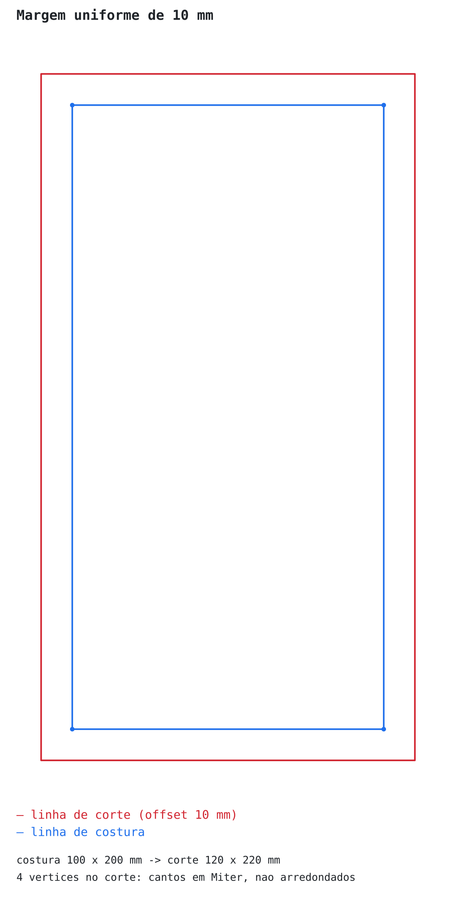
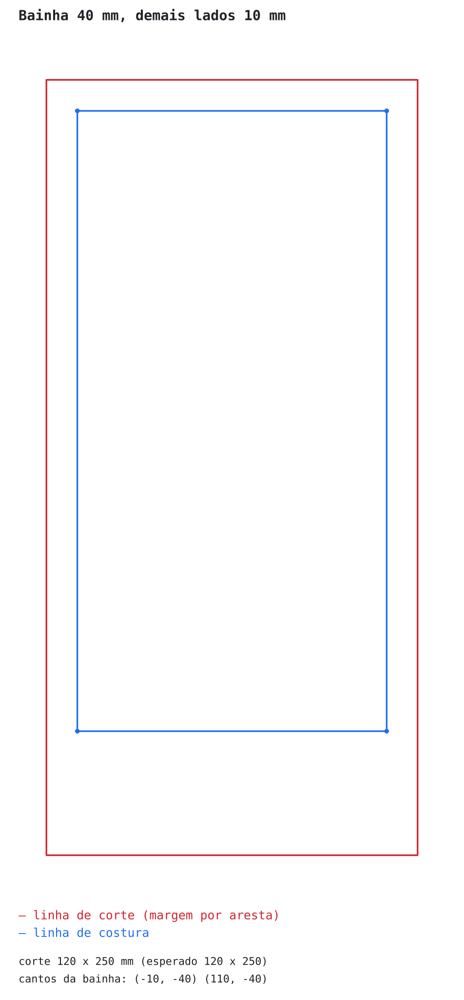
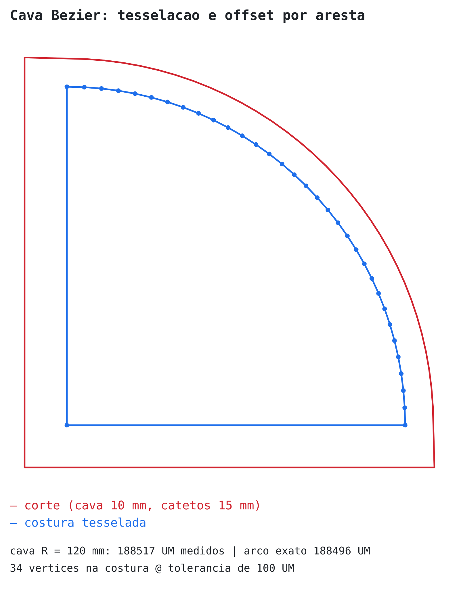
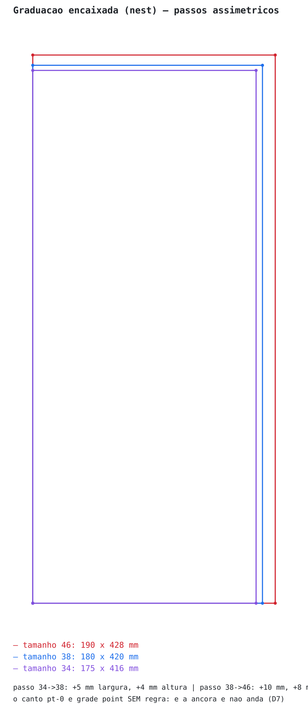
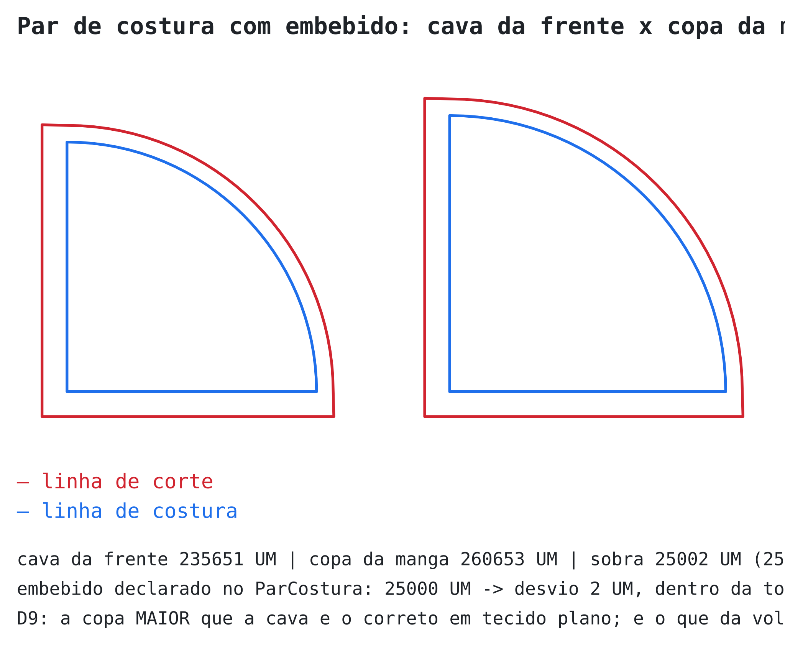
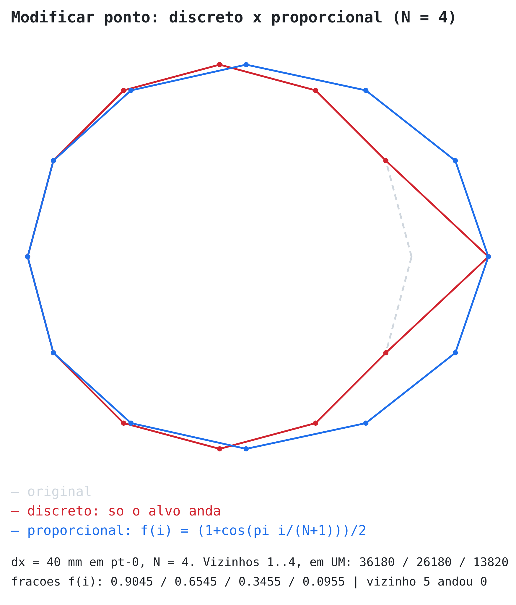

# FASE 1 · PARTE 7 — Casos de teste vindos do mundo real

> Parte **descritiva e de teste**, não normativa. Reúne números **de fontes externas verificáveis**
> (normas, sistemas de modelagem, prática de indústria) para conferir o motor contra a realidade,
> e não só contra si mesmo. Cada caso traz a fonte, o número esperado e o estado no motor hoje.
>
> As figuras em `MD/figuras/` são **geradas pelo próprio motor** (`node scripts/gerar-figuras.mjs`),
> não desenhadas à mão. Se o motor errar, a figura sai errada — é isso que as torna conferência e
> não ilustração.

## Por que esta parte existe

Os testes das Partes 5 e 6 provam que o motor é **coerente consigo mesmo**: o offset cresce, o
casamento fecha, o `s` é monotônico. Nenhum deles prova que o motor é **compatível com o ofício**.
Um motor pode passar em todos os testes e mesmo assim recusar a primeira peça real que chegar —
foi o que o caso 5 abaixo mostrou. Os quatro defeitos de modelo que esta pesquisa achou já estão
corrigidos e testados; o resumo no fim da página diz o estado de cada um.

---

## Caso 1 — Camadas do DXF ASTM/AAMA (compatibilidade da Fase 3)

**Fonte:** [documentação Patro do formato DXF ASTM](https://fabricesalvaire.github.io/Patro/resources/file-format/dxf-astm.html),
que tabula a ASTM D6673 (*Standard Practice for Sewn Products Pattern Data Interchange*, retirada
em 2019 mas ainda o formato de troca de fato).

| Camada | Conceito | Existe no modelo? |
|---|---|---|
| 1 | Contorno da peça | ✅ `Peca.contorno` |
| 2 | *Turn points* do contorno | ✅ `Ponto` tipo `contorno` |
| 3 | *Curve points* do contorno | ✅ controles da Bézier (D1) |
| 4 | Piques V e slit | ✅ `Pique` tipos `V`, `I` |
| 5 | Linha de referência de graduação | ✅ `LinhaInterna` tipo `referenciaGraduacao` *(era buraco)* |
| 6 | Linha de espelho / dobra | ✅ `EixoDobra` |
| 7 | Fio (direção do tecido) | ✅ `LinhaInterna` tipo `fio` |
| 8 | Linhas internas (não cortadas) | ✅ `LinhaInterna` |
| 9 / 10 | Referência de listra / xadrez | ❌ não existe — são de encaixe, Fase 5 |
| 11 | Recortes internos | ✅ `Peca.recortes` *(era buraco)* — offset e graduação **recusam** por ora |
| 13 | Furos e piques de broca | ✅ `LinhaInterna` tipo `furo` |
| 14 | Linha de costura | ✅ é o próprio contorno (D4) |
| 15 | Texto/anotação | ✅ `MetadadosPeca` |
| 80 / 81 / 82 / 83 | T-notch / castle / check / U-notch | ✅ completo *(faltavam 82 e 83)* |

**Três buracos achados pela conferência camada a camada — os três já fechados:**

1. **`Pique.tipo` não cobria a camada 82 (*check notch*) nem a 83 (*U-notch*).** Os oito tipos do
   cliente (`I` `V` `V1` `V2` `T` `MX` `M+` `MX2`) cobriam as camadas 4, 80 e 81; um pique de
   *check* ou *U* viraria "risco genérico" no round-trip da Fase 3, que é exatamente o que a Parte 1
   proíbe. Acrescentados `CHECK` e `U`.
2. **Camada 11 (recortes internos) não existia.** É estrutural: uma peça com furo interno — casa de
   gola, vazado de alça — não era representável, porque `Peca` só tinha o contorno externo.
3. **Camada 5 (linha de referência de graduação) não tinha par.** O modelo tinha `PontoGraduacao` e
   `RegraGraduacao`, mas não a *linha* de referência que o DXF transporta.

Continuam abertas as camadas **9 e 10** (referência de listra e xadrez): são de encaixe e podem
esperar a Fase 5.

✅ **Corrigido:** `TipoPique` ganhou `CHECK` e `U`, e o mapeamento virou dado
(`CAMADA_ASTM_DO_PIQUE`), com teste conferindo que todo tipo tem camada e que as cinco camadas da
norma estão alcançadas. `Peca.recortes` e `TipoLinhaInterna.referenciaGraduacao` também entraram.

**Teste que ainda falta, para quando a Fase 3 chegar:** importar um DXF com as camadas 4, 80, 81,
82 e 83 e verificar que os cinco tipos sobrevivem ao round-trip **sem colapsar num tipo só**.

---

## Caso 2 — Margem de costura por área da peça

**Fontes:** [tabela de margens da sewcalcs](https://sewcalcs.uk/reference/seam-allowance-chart/) e
a [documentação de margem do FreeSewing](https://freesewing.eu/docs/sewing/seam-allowance/) (projeto
de modelagem paramétrica de código aberto).

| Área | Margem real | No motor |
|---|---|---|
| Costura padrão | 10–15 mm | ✅ teste 1 (10 mm uniforme) |
| Cava e decote (curva) | **6–10 mm** | ✅ figura 3 (cava com 10 mm, catetos com 15 mm) |
| Bainha de saia/calça | **25–40 mm** | ✅ teste 2 (bainha de 40 mm) |
| Bainha de camisa/blusa | 10–20 mm | ✅ mesmo caminho do teste 2 |
| Costura francesa | mínimo 15 mm | ✅ é só um valor de margem |

**O que isso confirma:** a faixa real de margem numa **mesma peça** vai de 6 mm na cava a 40 mm na
bainha — uma razão de quase 7×. Isso é exatamente o caso que o `ClipperOffset.executeWithCallback`
não resolve (ver D6 na Parte 6) e a razão de o offset por aresta ter sido feito no motor. **Não era
um caso de canto: é o caso comum.**







---

## Caso 3 — Incrementos de graduação de um sistema real (M. Müller & Sohn)

**Fonte:** [M. Müller & Sohn, *Grading a Basic Bodice Block*](https://www.muellerundsohn.com/en/allgemein/grading-a-basic-bodice-block/)
— um dos sistemas de modelagem mais usados na Europa.

| Medida | Subindo (38→46), por tamanho | Descendo (38→34), por tamanho |
|---|---|---|
| Comprimento das costas até a cintura | **+4 mm** | **−3 mm** |
| Profundidade de cava (*scye depth*) | **+8 mm** | **−4 mm** |
| Largura das costas | **+10 mm** | **−5 mm** |
| Largura do decote (costas) | +4 mm | — |
| Ombro | +4 mm | — |
| ½ largura de cava | +7 mm | — |
| Largura do peito | +16 mm | −8 mm |

**O achado que importa: a graduação é ASSIMÉTRICA.** Subir do 38 custa +10 mm de largura de costas
por tamanho; descer custa apenas −5 mm. O corpo não encolhe na mesma proporção em que cresce.

**Isso valida a D8 diretamente.** A `RegraGraduacao` guarda `(deTamanho, paraTamanho, dx, dy)` por
**passo consecutivo**, então declarar `34→38: +5 mm` e `38→46: +10 mm` é natural. Um modelo que
guardasse "incremento por tamanho" como um valor único **não conseguiria representar este sistema**.

A figura abaixo é o caso Müller montado no motor, com o canto inferior esquerdo como âncora
(grade point **sem** regra, D7):



**Saída do motor:** tamanho 34 = 175 × 416 mm · 38 = 180 × 420 mm · 46 = 190 × 428 mm — os passos
assimétricos (−5/−4 e +10/+8) aparecem exatamente onde deveriam.

**Teste a escrever:** montar o corpo base do Müller com os 9 pontos numerados e conferir as
coordenadas nos três tamanhos contra a tabela. Precisa de um contorno com decote e cava curvos,
o que hoje o motor já suporta.

---

## Caso 4 — Dimensão do pique

**Fonte:** prática de indústria — o notcher padrão de modelagem corta **1/4″ × 1/16″**
(≈ **6,35 mm × 1,59 mm**); no tecido o pique vira um corte de **2–3 mm**
([The Cutting Class](https://www.thecuttingclass.com/pattern-notches-alexander-wang/),
[Kearing](https://www.kearing.com/choosing-the-best-pattern-notcher-for-sewing-tool-types-uses-and-trade-offs/)).

| Campo do `Pique` | Valor típico | Em UM |
|---|---|---|
| `alturaUM` (profundidade) | 6,35 mm | **6350** |
| `larguraUM` | 1,59 mm | **1590** |
| Corte no tecido | 2–3 mm | 2000–3000 |

**Consequência para a tolerância:** a largura do pique (1590 UM) é **8× maior** que a tolerância de
casamento (200 UM) e **16× maior** que a de tesselação (100 UM). Ou seja: o orçamento de tolerância
da Parte 6 tem folga confortável em relação ao menor elemento que o motor precisa posicionar. Isso
não estava conferido antes.

✅ **Aplicado:** os dois números viraram os padrões `ALTURA_PADRAO_DO_PIQUE_UM = 6350` e
`LARGURA_PADRAO_DO_PIQUE_UM = 1590` de `adicionarPique`, e a profundidade virou **regra de ofício
conferida**: pique mais fundo que a margem da aresta levanta o aviso
`PIQUE_MAIS_FUNDO_QUE_A_MARGEM`, porque o corte passaria da linha de costura e apareceria na peça
pronta. Ver a Parte 6.

---

## Caso 5 — ⚠️ Embebido da copa de manga: um defeito de modelo que esta pesquisa encontrou

**Fontes:** [Threads Magazine, *The Sleeve-Cap Seam and the Armscye*](https://www.threadsmagazine.com/project-guides/fit-and-sew-tops/the-sleeve-cap-seam-and-the-armscye),
[Threads, *On Fitting Sleeves*](https://www.threadsmagazine.com/project-guides/fit-and-sew-tops/on-fitting-sleeves),
[Curvy Sewing Collective](https://curvysewingcollective.com/making-your-sleeves-fit/).

**O fato:** em tecido plano, a copa da manga é **de propósito mais comprida** que a cava. A
diferença é o *embebido* (ease), e ela é intencional — é o que dá volume ao ombro:

| Peça | Embebido típico |
|---|---|
| Camisa (ombro caído, copa baixa) | ≤ 25 mm (1″), às vezes zero |
| Blusa com manga montada no ombro natural | 25 mm (1″) |
| Casaco / alfaiataria | 20–50 mm (3/4″ a 2″) |
| Malha | **zero** (no máximo ~3 mm) |

**O problema no motor:** `validarCasamento` exige que as duas arestas de um `ParCostura` tenham o
**mesmo comprimento**, com tolerância de 200 UM (0,02 cm). Um embebido real de 25 mm são
**25 000 UM** — 125 vezes a tolerância. Ou seja:

> Do jeito que está hoje, o motor **acusaria erro em toda camisa de tecido plano do mundo**.
> Os testes passam porque o fixture foi construído com as duas cavas congruentes.



**A correção — ✅ implementada como D9** (ver Parte 6 para os números conferidos): `ParCostura`
ganha o embebido esperado, e a validação compara contra ele em vez de contra zero.

```ts
interface ParCostura {
  id: string; modeloId: string;
  arestaA: string; arestaB: string;
  /** Quanto arestaB deve ser MAIOR que arestaA. Zero em costura reta; 25 mm numa copa de manga. */
  embebidoUM: UM;
}
```

E `validarCasamento` compara `|comprimentoB − comprimentoA − embebidoUM| > TOLERANCIA_CASAMENTO_UM`.
Com `embebidoUM = 0` o comportamento de hoje fica idêntico — nenhum teste existente quebra.

**Como ficou:** `embebidoUM` é **obrigatório** no payload de `DefinirParCostura` — sem default.
Declarar "fecha exata" (zero) e "embebe 25 mm" são decisões diferentes, e o evento tem que registrar
qual foi tomada. Com `embebidoUM = 0` o comportamento é o de antes, e nenhum teste existente quebrou.

Não foi implementado o `embebidoPorTamanho` que eu havia esboçado: não achei fonte dizendo que o
embebido varia por tamanho dentro de uma mesma peça, e campo sem evidência é especulação. É aditivo
se aparecer a necessidade.

---

## Caso 6 — Modo proporcional conferido contra a fórmula

Não vem de fonte externa (a fórmula é fixada na Parte 3), mas a figura mostra o que os números
significam, que é o que a Parte 5 pede ao dizer "conferir os números, não 'parece suave'":



**Saída do motor** com `dx = 40 mm` e `N = 4`: vizinhos andam **36180 / 26180 / 13820 / 3820 UM**,
frações **0,9045 / 0,6545 / 0,3455 / 0,0955**, e o **quinto vizinho anda 0**.

---

## Resumo: o que esta pesquisa mudou

| # | Achado | Gravidade | Estado |
|---|---|---|---|
| 5 | **Embebido da copa de manga não é representável** — `validarCasamento` reprovaria qualquer peça real | **alta** | ✅ **corrigido (D9)**, 6 testes |
| 1 | `Pique.tipo` não cobre *check* (82) e *U-notch* (83) | média | ✅ **corrigido** + `CAMADA_ASTM_DO_PIQUE` |
| 1 | Recortes internos (camada 11) não existem no modelo | média | ✅ **conceito criado**; offset e graduação **recusam** |
| 1 | Linha de referência de graduação (camada 5) não existe | baixa | ✅ **corrigido** (`TipoLinhaInterna`) |
| 1 | Referência de listra e xadrez (camadas 9 e 10) | baixa | ⚠️ aberto — são de encaixe, Fase 5 |
| 3 | Graduação assimétrica sobe/desce | — | ✅ **D8 já cobre**, confirmado |
| 2 | Margem de 6 mm a 40 mm na mesma peça é o caso comum | — | ✅ **D6 já cobre**, confirmado |
| 4 | Pique de 1,59 mm é 8× a tolerância de casamento | — | ✅ orçamento de tolerância tem folga |

## Como regerar as figuras

```bash
npm run build && node scripts/gerar-figuras.mjs
```
